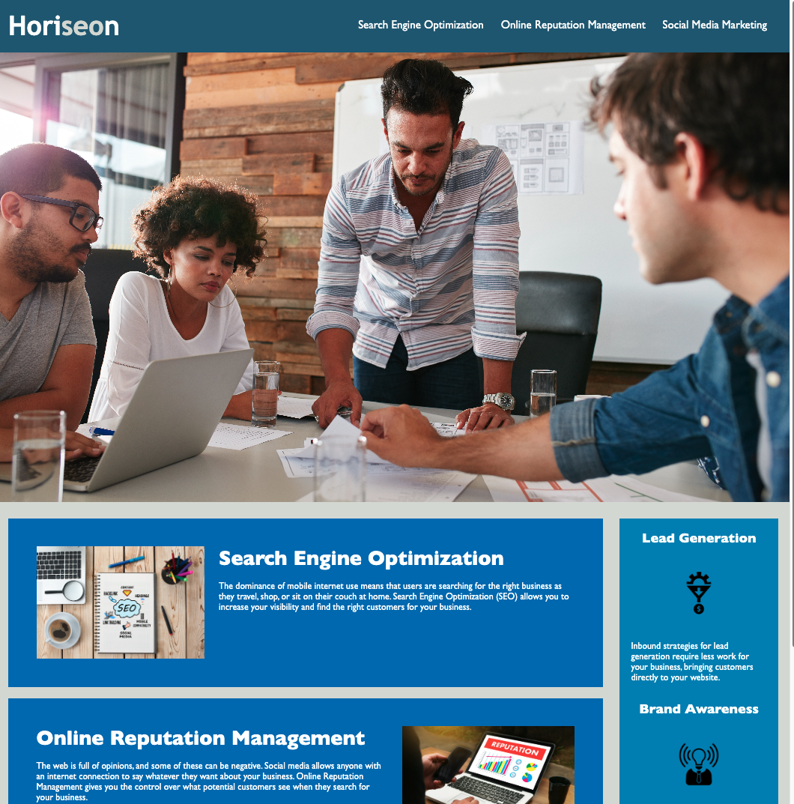

# Horiseon Homepage Update

## **Table of Contents:**
1. Introduction
2. Link to Deployed Page
3. Changes Made
4. Image Comparison

## **1.    Introduction**

** **This code was originally authored and provided by <u>Horiseon Social Solution Services, Inc.</u> and is only intended for teaching purposes. This is not to be used for any other purpose or for any other commercial use.**

The goal of this project was to take the existing Horiseon Social Solution homepage code and clean it up for more visibility and accessibility for all end users as well as reduced redundancy in the code used.

## **2.   Link to Deployed Page**

https://jeremydray.github.io/horiseon-homepage/

## **3.  Changes Made**

While the changes did **<u>not</u>** affect the appearance of the webpage on the surface level, these were helpful for the end users:

* Visibility: Replaced non-semantic div elements with more semantic elements to specify sections of the webpage more clearly.

* Accessibility: Added alt text to images for better user access and comments in code documenting changes made for any future code reviewers. 

* Reduced Code Redundancy: Consolidated CSS styles that were serving the same purpose for several sections into one CSS selector for several items. 

## **4. Image Comparison**

### Original Webpage  
  
### Updated Webpage  
